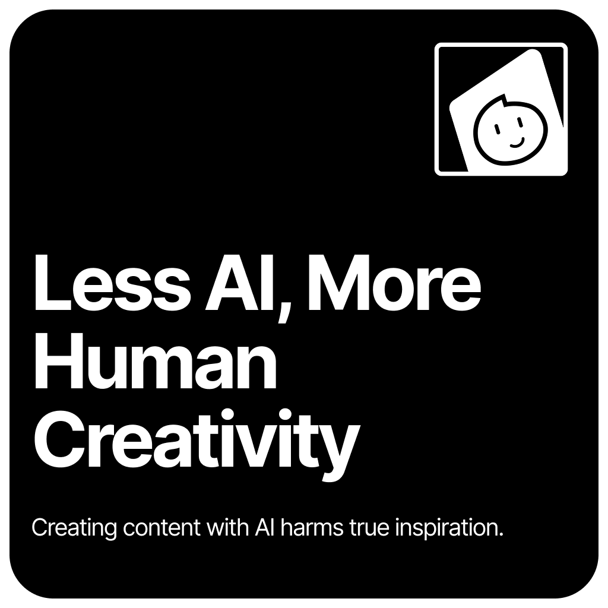

# About Me
I'm actually a **digital artist who create illustrations** just for fun but in the world of GitHub, I'm actually doing small bits of programming to experiment on skills that I want to learn or improve based on the coding language I'm using.

You might recognize me as a member of the **Obsidian Members Group**, a vibrant community dedicated to sharing insights, expertise, and skills related to the [Obsidian](https://obsidian.md) note-taking software, which harnesses the power of Markdown language.

## Stance on Artificial Intelligence

We all recognize the potential of artificial intelligence to impact our lives significantly. However, I believe there are both advantages and disadvantages to using these tools. That’s why I developed the “Less AI, More Human Creativity” stance. This approach emphasizes that I utilize AI tools solely for ideas and experimental purposes (currently I use it for grammar checking).

# Tools and Skills

## Platforms I use:

## Software I use:

## Programming Languages I use:

## Planned to learn these tools and languages:
